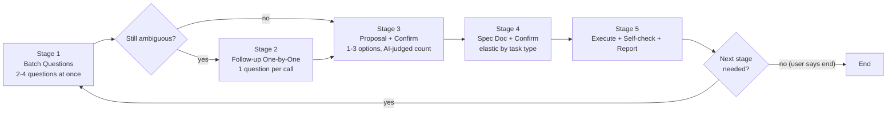

# Iterative Discussion

[English](#english) | [中文](README.md)

A TRAE skill that enforces an **iterative discussion and confirmation workflow before any task execution**. Through five stages — batch questions, follow-up, proposal confirmation, spec confirmation, and post-execution follow-up — it ensures alignment with the user before any implementation, eliminating wasted work from unexamined assumptions.

> **Read this in: [中文](README.md)**

---

<a name="english"></a>
## What It Does

Any task — no matter how small — must go through a 5-stage confirmation flow before implementation begins, and must end with a follow-up question rather than silently terminating the conversation.

The skill itself is just a prompt (a `SKILL.md` file) plus a `user_rule` that forces TRAE to invoke it on every task. There is no runtime code; the mechanism is:

1. **SKILL.md instruction text** — defines when to ask, what to ask, how to ask
2. **`AskUserQuestion` tool calls** — renders interactive question cards, returns user choices to the AI
3. **HARD-GATE** — a hard constraint that forbids any implementation action until the user approves

## 5-Stage Flow



### Stage Details

- **Stage 1 Batch Questions**: Immediately call `AskUserQuestion` once with 2-4 key questions covering purpose, constraints, success criteria, ambiguities. 2-4 options per question, always include "Other".
- **Stage 2 Follow-up**: Review answers, ask follow-up one at a time (1 question per call) for any remaining ambiguity until clear. May be skipped if Stage 1 answers are sufficient.
- **Stage 3 Proposal + Confirm**: Give proposals based on complexity — 1 proposal + tradeoffs if only one obvious approach; 2-3 for comparison if multiple paths exist. Use `AskUserQuestion` for user to choose/modify/reject. No action before confirmation.
- **Stage 4 Spec + Confirm**: Generate spec docs per task-type table below, confirm via `AskUserQuestion`. **Never use `NotifyUser` for confirmation** (it interrupts the dialog).
- **Stage 5 Execute + Follow-up**: Execute → self-check → report → use `AskUserQuestion` to ask "any next-stage task / supplement / adjustment / redo / end". Only ends when user says "end"; otherwise returns to Stage 1.

## Task-Type-Specific Spec Rules

Spec document detail is elastic based on task type — no one-size-fits-all three-document requirement:

| Task Type | Spec Document | Question Focus | Acceptance |
|---|---|---|---|
| **Debug** | May omit; write `spec.md` (symptom+root cause+fix) if root cause is complex | Repro conditions, blast radius, temp workaround needed? | Symptom gone, no regression |
| **Refactoring** | `spec.md` + `checklist.md` | Motivation, interface changes, rollback strategy | Behavior unchanged + tests green |
| **Feature** | Full set: `spec.md` + `checklist.md` + `tasks.md` | Purpose, boundaries, success criteria, ambiguities | Meets spec acceptance items |
| **Ops** | `spec.md` (a few lines); `checklist.md` for high-risk ops | Blast radius, rollback, time window | Op complete + system healthy |
| **Other/Unclear** | AI judgment, lean simple | Purpose, constraints | Goal achieved |

**Spec may be omitted when**: simple debug root cause, the task itself is "make a skill / read a file / one-line fix", or the user explicitly says "skip spec". Even then, Stage 3 (proposal confirm) and Stage 5 (follow-up question) are never skipped.

## Pros & Cons

**Pros**
- Eliminates wasted work from unexamined assumptions — even "simple" tasks get a sanity check
- Batch questioning (Stage 1) is faster than one-at-a-time for gathering key details
- Elastic spec rules avoid burdening trivial tasks with three-document overhead
- Mandatory follow-up question prevents the AI from silently ending the conversation
- Confirmation via `AskUserQuestion` (not `NotifyUser`) avoids dialog interruption

**Cons**
- Every task pays an upfront questioning cost — can feel heavy for truly trivial operations
- Requires a companion `user_rule` to guarantee triggering; relying on the skill description alone may miss fires
- The AI must judge task type and spec detail level — quality depends on the model

## Installation

### 1. Copy the skill

Place `SKILL.md` under your TRAE skills directory:

```
<trae-config-dir>/skills/iterative-discussion/SKILL.md
```

On Windows the config dir is typically `C:\Users\<you>\.trae-cn\` (CN build) or `C:\Users\<you>\.trae\` (international).

### 2. Add the user rule

Copy the contents of [`user-rule.md`](user-rule.md) into a new file under:

```
<trae-config-dir>/user_rules/rule-<timestamp>.md
```

This forces TRAE to invoke `iterative-discussion` on every task. Without it, the skill relies on the AI's self-judgment and may not fire.

### 3. Verify

Start a new TRAE session and give it any task. The AI should immediately call `AskUserQuestion` with 2-4 questions before doing anything else.

## Files

- [`SKILL.md`](SKILL.md) — the skill definition (5-stage flow, HARD-GATE, task-type table, AskUserQuestion rules)
- [`user-rule.md`](user-rule.md) — the mandatory trigger rule
- [`README.md`](README.md) — Chinese version (GitHub homepage default)
- [`README.en.md`](README.en.md) — this file (English)
- [`LICENSE`](LICENSE) — MIT License

## License

[MIT License](LICENSE) © 2026 fujiaze
