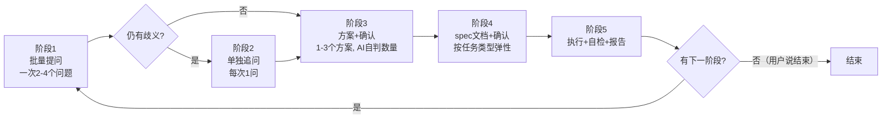

# 迭代讨论（Iterative Discussion）

[中文](#中文) | [English](README.en.md)

一个 TRAE 技能，**在任何任务执行前强制走迭代讨论与确认流程**。通过批量提问、单独追问、方案确认、spec 确认、执行后追问五阶段，确保动手前与用户对齐，避免未审视假设导致的返工。

> **切换语言：[English](README.en.md)**

---

<a name="中文"></a>
## 它做什么

任何任务——无论多小——在动手实施前都必须走完 5 阶段确认流程，且结束后必须追问用户是否还有下一阶段，而不是自行结束对话。

技能本身只是一段 prompt（一个 `SKILL.md` 文件）加一条 `user_rule` 强制 TRAE 每个任务都调用它。没有任何运行时代码，机制是：

1. **SKILL.md 指令文本** —— 规定何时问、问什么、怎么问
2. **`AskUserQuestion` 工具调用** —— 渲染交互式问题卡片，把用户选择回传给 AI
3. **HARD-GATE 强制门** —— 硬约束，用户未批准前禁止任何实施动作

## 五阶段流程



### 阶段说明

- **阶段 1 批量提问**：收到任务后立即用 `AskUserQuestion` 单次调用，提 2-4 个关键问题，覆盖目的、约束、成功标准、歧义点。每问 2-4 个选项，必有"其他"。
- **阶段 2 单独追问**：审阅回答，对仍模糊的点逐个单独追问（每次 1 问），直到无歧义。若阶段 1 已充分可跳过。
- **阶段 3 方案+确认**：按任务复杂度给方案——明显只有一种做法就给 1 个 + 权衡；有多条路径就给 2-3 个对比。用 `AskUserQuestion` 让用户选/改/否。未确认不动手。
- **阶段 4 spec+确认**：按下方任务类型表生成 spec 文档，用 `AskUserQuestion` 确认。**禁止用 `NotifyUser` 做确认**（它会中断对话）。
- **阶段 5 执行+追问**：执行任务 → 自检 → 报告 → 用 `AskUserQuestion` 问"是否有下一阶段任务/补充/调整/重做/结束"。用户说"结束"才结束；说有则回到阶段 1。

## 按任务类型的 spec 规范

spec 文档详略按任务类型弹性调整——不搞一刀切的三件套：

| 任务类型 | spec 文档 | 提问侧重 | 验证标准 |
|---|---|---|---|
| **debug 任务** | 可省；根因复杂则写 `spec.md`（症状+根因+修复方案） | 复现条件、影响范围、是否需保留临时绕过 | 原症状消失、无回归 |
| **工程重构** | 必出 `spec.md` + `checklist.md` | 重构动机、对外接口是否变、回滚策略 | 行为不变 + 测试全绿 |
| **功能实现** | 必出三件套：`spec.md` + `checklist.md` + `tasks.md` | 目的、边界、成功标准、歧义点 | 满足 spec 验收项 |
| **运维任务** | `spec.md` 几行；高危操作必出 `checklist.md` | 影响范围、回滚、时间窗 | 操作完成 + 系统正常 |
| **其他/不确定** | AI 判断，倾向从简 | 目的、约束 | 目标达成 |

**spec 可省的明确条件**：debug 根因简单、任务本身是"制作技能/读文件/单行修复"等极简任务、或用户明确说"跳过 spec 直接做"。即便省 spec，阶段 3（方案确认）和阶段 5（追问）也不省。

## 优缺点

**优点**
- 消除未审视假设导致的返工——哪怕"简单"任务也过一道 sanity check
- 阶段 1 批量提问（一次 2-4 问）比逐个问更快收集关键细节
- 弹性 spec 规则避免极简任务被三件套文档压垮
- 阶段 5 强制追问，防止 AI 自行结束对话
- 确认一律用 `AskUserQuestion`（不用 `NotifyUser`），避免中断对话

**缺点**
- 每个任务都有前置提问成本——对真正琐碎的操作可能显重
- 需配套 `user_rule` 才能保证触发；仅靠技能 description 可能漏触发
- AI 需判断任务类型和 spec 详略——质量依赖模型能力

## 安装

### 1. 复制技能文件

把 `SKILL.md` 放到 TRAE 技能目录下：

```
<trae配置目录>/skills/iterative-discussion/SKILL.md
```

Windows 上配置目录通常是 `C:\Users\<你>\.trae-cn\`（国内版）或 `C:\Users\<你>\.trae\`（国际版）。

### 2. 添加 user_rule

把 [`user-rule.md`](user-rule.md) 的内容复制到：

```
<trae配置目录>/user_rules/rule-<时间戳>.md
```

这条规则强制 TRAE 每个任务都调用 `iterative-discussion`。没有它，技能只能靠 AI 自主判断触发，可能漏触发。

### 3. 验证

开一个新的 TRAE 会话，给任意任务。AI 应当立即调用 `AskUserQuestion` 提 2-4 个问题，再做其他事。

## 文件

- [`SKILL.md`](SKILL.md) —— 技能定义（5 阶段流程、HARD-GATE、任务类型表、AskUserQuestion 规则）
- [`user-rule.md`](user-rule.md) —— 强制触发规则
- [`README.md`](README.md) —— 本文件（中文，GitHub 首页默认显示）
- [`README.en.md`](README.en.md) —— 英文版
- [`LICENSE`](LICENSE) —— MIT 许可证

## 许可证

[MIT License](LICENSE) © 2026 fujiaze
